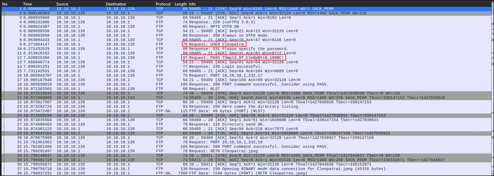
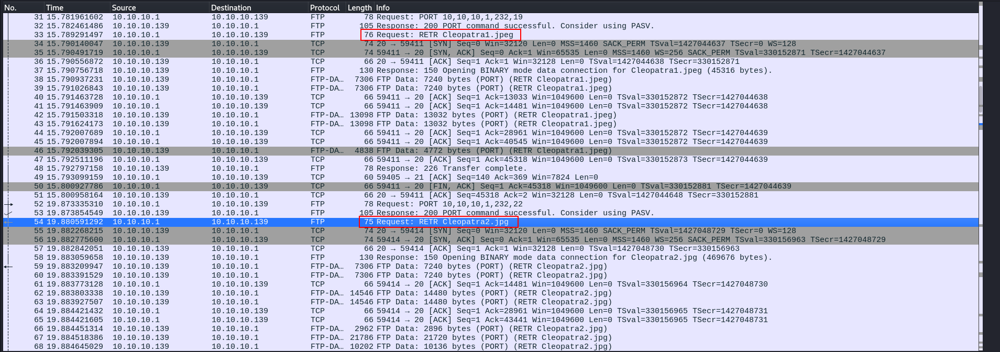

# Writeup
In this challenge, we’re provided with a network traffic capture file. Upon examining it in Wireshark, we can observe an FTP transfer process, where images are being uploaded or downloaded.

### Step 1: Extracting the FTP Username and Password
- Within the FTP traffic, look for `USER` and `PASS` commands, which reveal the username and password used for the FTP session.



Username: `Cleopatra`
Password: `T3mpl3_0f_Cle0p@tr@_196BC!`

### Step 2: Extracting the Files Transferred
- Now, look for any `RETR` (retrieve) or `STOR` (store) commands to identify which files were transferred.
- Follow the TCP stream for these packets, and you’ll find a list of image files transferred.



### Step 3: Reconstructing the Transferred Files
- Go to **File** → **Export Objects** → **FTP** in Wireshark to extract the images that were transferred over the FTP session.
- Save these images locally for further investigation.

### Step 4: View the Images to Get the Secret
- Viewing image Cleopatra2.jpg 


### Step 5: Final Flag:
```
PlaygroundsCTF{Cleopatra_T3mpl3_0f_Cle0p@tr@_196BC!_I_Am_The_Last_Queen}
```