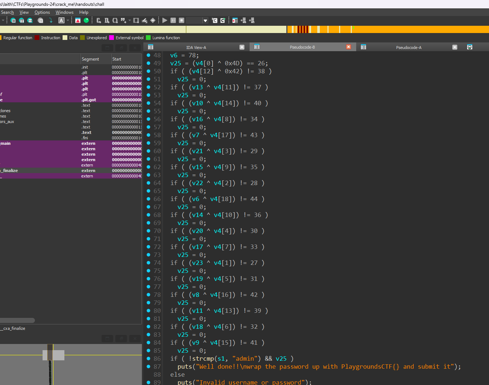

The first step in rev challs is to know what are we dealing with.
so running the command `file` on the chall we get:


we get that it is a ELF 64-bit LSB pie executable which we can run by simply typing its name
```
./chall
```
> you may need to change the permissions on the file by running `chmod +x chall`

the file askes for a username and a password we need to open the chall file witha disassembler:
`ida` `ghidra` `binaryninja` ...

opening with ida:

we can understand some stuff but by pressing the `f5` key we can decompile to c-like code

reading through the code we can see that it takes our input (v4) and xor it with a number then comparing it another.
One thing to note is that the XOR operation is reversible and interchangeable.
that means if we do 0x1d ^ 0x11 = 0xc --> 0x1d ^ 0xc = 0x11
by following that we can do the same for our chall considering the index in v4[]
> u can do that in python or in cyberchef
username = admin
password = Wubba_Lubba_dub_dub
