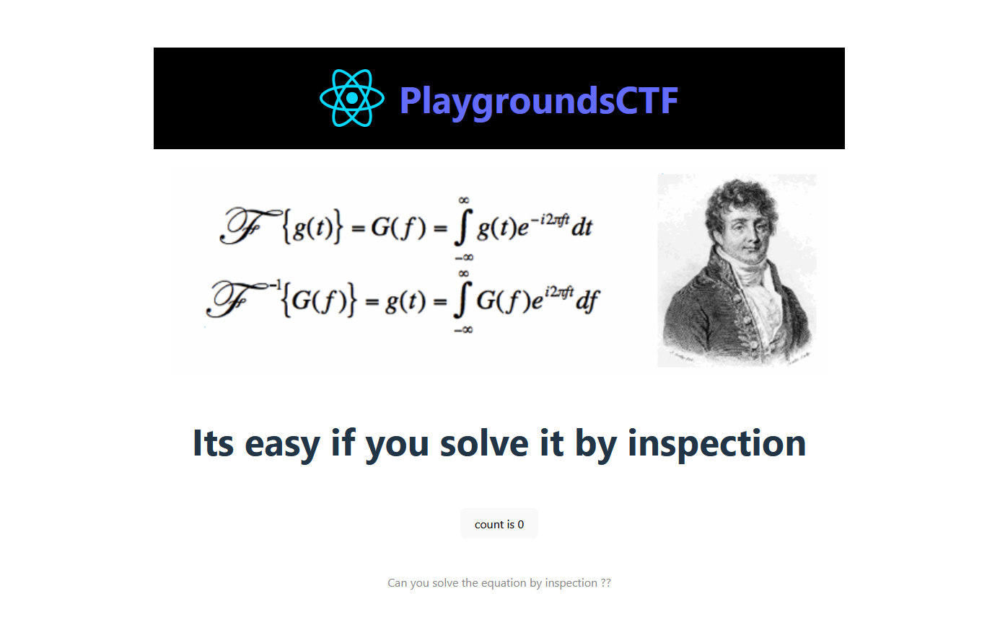
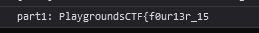
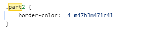
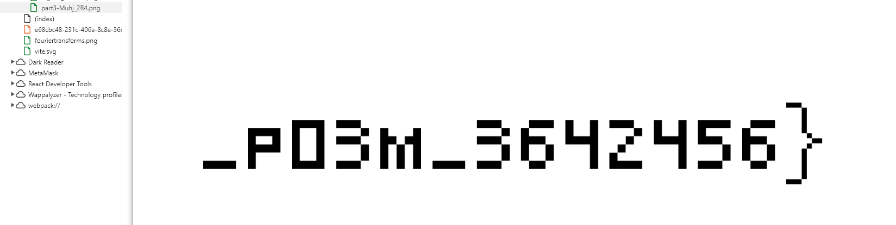

# Challenge Name: By Inspection
## author: CodeBreaker44
## Description: I am the world greatest scientist

### solution:
First the user will access a website this will have the flag divided into multiple parts over the source code of the web app
first part can be found the Javascript console within the browser,
second part will be inside the css file
last part will be in assets as an image

each part will be ladled with part1, part2 and part3.

here is a demo on how to solve it:

full flag: PlaygroundsCTF{f0ur13r_15_4_m47h3m471c4l_p03M_3642456}