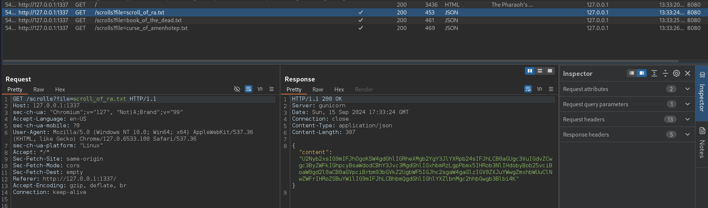
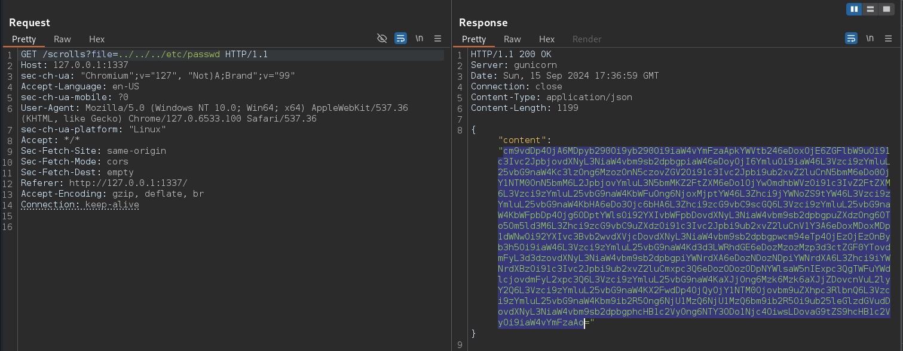
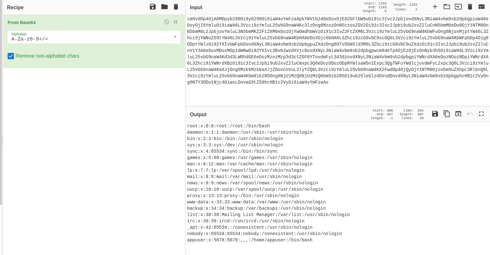
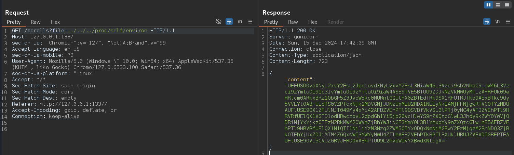
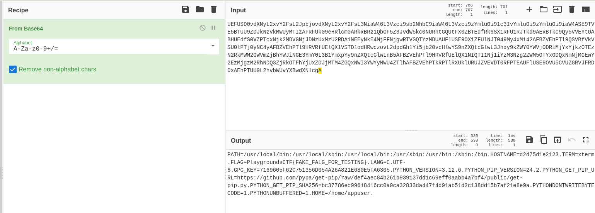

# Write-Up

## TL;DR
Basic LFI vulnerability

### Solution
1. By intercepting requests using Burp Suite, we notice the requests responsible for retrieving the scrolls.
   
2. We notice that there is a parameter in the URL called `file`, which indicates that the scrolls are probably saved in text files on the server, and they are being retrieved using the name of the file. The content is returned in Base64 format.
3. Check if there is an LFI vulnerability by trying to read `/etc/passwd`:
    1. Send one of the requests to Repeater using `CTRL+R`.
    2. Modify the `file` parameter to `../../../etc/passwd`.
       
    3. Decode it using CyberChef.
       
4. Now to read the flag, you need to read the environment variables in `/proc/self/environ`.
    
    
